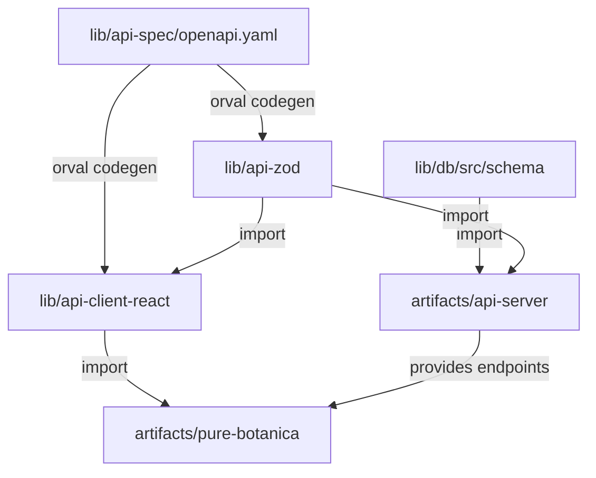

# Pure Botanica Monorepo Analysis & System Architecture Report

Welcome to the comprehensive system architecture and analysis report for the **Pure Botanica** project. This document details the monorepo structure, database schema, backend endpoints, scoring algorithms, frontend configuration, security protocols, and development workflows.

---

## 1. Executive Summary
**Pure Botanica** (internally identified as `Herbal-Hub`) is a full-stack, plant-powered pediatric wellness web application. The platform is designed specifically to help parents identify the most appropriate botanical supplements (such as *Focus Gummies* or *Mineral Gummies*) for children ages 3–12. 

The application utilizes an interactive multi-step assessment that gathers lifestyle, dietary, behavioral, and medical data. An underlying scoring algorithm determines the child's needs and outputs custom-tailored recommendations. It also provides a secure administrative dashboard where admins can monitor user submissions, analyze user demographics, evaluate common symptoms, and export data.

---

## 2. Monorepo Architecture & Package Structure
The project is built as a TypeScript-first monorepo using **pnpm workspaces**. It enforces modularity and code reuse by separating database models, API specs, generated client packages, and servers into distinct workspaces.

Below is the directory tree mapping the monorepo's packages:

```
Gummies (Root Workspace)
├── pnpm-workspace.yaml          # Defines workspaces, catalogs common dependencies, security rules
├── package.json                 # Monorepo build, dev, and type-checking scripts
├── tsconfig.json                # Root TypeScript configuration
├── tsconfig.base.json           # Common TS compiler options shared across packages
│
├── lib/                         # Shared libraries
│   ├── db/                      # Direct local JSON database workspace
│   │   └── src/
│   │       ├── schema/          # Database TypeScript models & Zod schemas
│   │       └── index.ts         # JSON file read/write database helpers
│   │
│   ├── api-spec/                # OpenAPI contract & Orval codegen configuration
│   │   ├── openapi.yaml         # API Specification (Source of Truth)
│   │   └── orval.config.ts      # Orval client and validator generator config
│   │
│   ├── api-zod/                 # Auto-generated Zod validation schemas
│   │   └── src/generated/       # Orval-emitted request/response validation code
│   │
│   └── api-client-react/        # Auto-generated React Query API hooks
│       └── src/
│           ├── custom-fetch.ts  # Shared mutator using standard fetch with error handling
│           └── generated/       # Orval-emitted hook definitions
│
├── artifacts/                   # Application packages
│   ├── api-server/              # Express API Server (port 8080)
│   │   └── src/
│   │       ├── app.ts           # Express App configuration (middlewares, sessions)
│   │       ├── index.ts         # Server entry point
│   │       ├── lib/             # Helper libs (scoring.ts, logger.ts)
│   │       └── routes/          # Express routes (assessments, health, admin dashboard)
│   │
│   ├── pure-botanica/           # React + Vite frontend application
│   │   └── src/
│   │       ├── App.tsx          # Client-side router and provider setups
│   │       ├── pages/           # Pages (Home, Products, Assessment, Results, Admin Dashboard)
│   │       ├── components/      # layout & custom UI elements (Tailwind CSS + shadcn/ui)
│   │       └── lib/             # Multi-language translation dictionaries and context
│   │
│   └── mockup-sandbox/          # Replit mockup rendering sandbox
│
└── scripts/                     # Helper script utilities (such as git post-merge automation)
```

### Dependency Flow and Code Generation


---

## 3. Database Design & Schema Layout
The database is managed using **direct local JSON file storage** (saved in `db.json`). Instead of a relational SQL database, a single flat structure is used for the assessments. This design choice is ideal for this application, as it simplifies queries, requires no external database servers, and models each submission as a self-contained history snapshot.

### Schema Details: `lib/db/src/schema/assessments.ts`
The JSON schema captures three categories of information in one flat record:

| Field Group | Column Name | Data Type | Constraint / Default | Description |
|---|---|---|---|---|
| **System Info** | `id` | `serial` | Primary Key | Auto-incrementing identifier. |
| **System Info** | `created_at` | `timestamp` | `notNull()`, `defaultNow()` | Time of submission (with timezone). |
| **Parent Profile** | `parent_name` | `text` | `notNull()` | Name of the responding parent. |
| **Parent Profile** | `email` | `text` | `notNull()` | Email (used for newsletter / result sharing). |
| **Parent Profile** | `phone` | `text` | Optional | Phone number. |
| **Child Profile** | `child_name` | `text` | `notNull()` | Child's first name. |
| **Child Profile** | `age` | `integer` | `notNull()` | Child's age (restricted to 3–12 in frontend). |
| **Child Profile** | `gender` | `text` | `notNull()` | Child's gender (`male`, `female`, `other`). |
| **Lifestyle/Behavior**| `activity_level` | `text` | `notNull()` | Physical activity indicator (`calm`, `average`, `very_active`). |
| **Lifestyle/Behavior**| `focus_difficulty`| `text` | `notNull()` | Difficulty concentrating (`never`, `sometimes`, `often`). |
| **Lifestyle/Behavior**| `hyperactivity` | `text` | `notNull()` | Ability to sit still (`never`, `sometimes`, `often`). |
| **Lifestyle/Behavior**| `homework` | `text` | `notNull()` | After-school homework difficulty (`yes`, `sometimes`, `no`). |
| **Nutrition** | `diet` | `text` | `notNull()` | Subjective dietary quality (`excellent`, `good`, `average`, `poor`). |
| **Nutrition** | `vegetables` | `text` | `notNull()` | Vegetable servings per day (`0`, `1`, `2+`, `3+`). |
| **Nutrition** | `supplements` | `text` | `notNull()` | Taking other daily supplements (`yes`, `no`). |
| **Health & Meds** | `allergies` | `text` | Optional | Allergies text. |
| **Health & Meds** | `medications` | `text` | Optional | Daily medications text. |
| **Health & Meds** | `notes` | `text` | Optional | Custom notes or remarks. |
| **Scoring Output** | `focus_score` | `integer` | `notNull()` | Focus score computed by the backend. |
| **Scoring Output** | `mineral_score` | `integer` | `notNull()` | Mineral score computed by the backend. |
| **Scoring Output** | `recommendation` | `text` | `notNull()` | Formula recommended (`focus`, `mineral`, `both`). |

---

## 4. Scoring Algorithm & Recommendation Logic
The backend server (`artifacts/api-server/src/lib/scoring.ts`) computes two separate health scores based on parents' input.

### Focus Score (Cognitive Restlessness Indicator)
Targeting cognitive focus and hyperactivity, the score accumulates up to a maximum of **10 points** as follows:
- **General Activity**: `activityLevel === "very_active"` $\rightarrow$ **+3 points**
- **Concentration Issues**: `focusDifficulty === "often"` $\rightarrow$ **+3 points** | `sometimes` $\rightarrow$ **+1 point**
- **Restlessness/Hyperactivity**: `hyperactivity === "often"` $\rightarrow$ **+2 points** | `sometimes` $\rightarrow$ **+1 point**
- **Homework Friction**: `homework === "no"` $\rightarrow$ **+2 points** | `sometimes` $\rightarrow$ **+1 point**

*Threshold:* A Focus Score **$\ge 4$** qualifies the child for Focus support.

### Mineral Score (Nutritional Deficit Indicator)
Targeting structural minerals and restorative sleep, this score accumulates up to a maximum of **8 points** as follows:
- **Dietary Quality**: `diet === "poor"` $\rightarrow$ **+3 points** | `average` $\rightarrow$ **+1 point**
- **Vegetable Intake**: `vegetables === "0"` $\rightarrow$ **+3 points** | `1` $\rightarrow$ **+1 point**
- **Supplement Habit**: `supplements === "no"` $\rightarrow$ **+2 points**

*Threshold:* A Mineral Score **$\ge 3$** qualifies the child for Mineral support.

### Formula Mapping Rules
```typescript
const needsFocus = focusScore >= 4;
const needsMineral = mineralScore >= 3;

if (needsFocus && needsMineral) return "both";
if (needsFocus) return "focus";
return "mineral"; // Safe fallback recommendation
```
*Design Note:* The algorithm defaults to `"mineral"` if neither threshold is reached, ensuring parents always receive a relevant botanical wellness starting point (Magnesium & Chamomile for restorative rest).

---

## 5. API Design & OpenAPI Spec
The system integrates an API-first approach, using `openapi.yaml` as the contract source of truth.

### Public Endpoints
- **`GET /healthz`**: System health check. Returns status `{"status": "healthy"}`.
- **`POST /assessments`**: Submits a completed parent questionnaire. Validates inputs using auto-generated Zod schemas, triggers the scoring logic, records the entry in the database, and returns the computed scores and recommendations in a `201 Created` response.
- **`GET /assessments/{id}`**: Returns the assessment results and recommendation payload for a specific ID. Publicly accessible for displaying the final results screen.

### Administrative Endpoints (Protected by Session Auth)
- **`POST /admin/login`**: Authenticates an administrator using the `ADMIN_PASSWORD` (default: `purebotanica2024`). Successful requests set `req.session.isAdmin = true`.
- **`POST /admin/logout`**: Destroys the active session cookie.
- **`GET /admin/me`**: Returns the current session's validation status.
- **`GET /admin/stats`**: Compiles dashboard analytics:
  - Total count of submissions.
  - Split counts for recommendations (`focus`, `mineral`, `both`).
  - Age, Gender, and Recommendation distribution groups.
  - Common symptoms aggregated from assessment metrics.
- **`GET /admin/assessments`**: Paginated, filterable, and searchable list of all submissions.
  - *Query filters:* `search` (fuzzy matches parent name, child name, or email), `recommendation` (filters by recommendation formula), `page` (pagination offset), `limit` (default: 20).
- **`GET /admin/assessments/{id}`**: Retrieves comprehensive assessment details.
- **`DELETE /admin/assessments/{id}`**: Permanently deletes an assessment entry.
- **`GET /admin/assessments/export`**: Compiles all submissions from the database, escapes comma-separated values, and streams them as an attachment CSV file (`assessments.csv`).

---

## 6. Frontend Presentation & Internationalization
The frontend application (`artifacts/pure-botanica`) is built on **React** powered by **Vite** and styled using **Tailwind CSS** and **shadcn/ui**.

### Key Frontend Components & Pages
1. **Home (`/`)**: High-premium hero introduction, core formula showcases, trust indicators, step-by-step guidance, and real parent testimonials.
2. **Products (`/products`)**: Comprehensive details about *Focus Gummies* (Lemon Balm & Passionflower) and *Mineral Gummies* (Magnesium & Chamomile).
3. **Assessment Wizard (`/assessment`)**: An interactive 5-step form (Parent info, Child info, Lifestyle, Nutrition, and Health) with step validation and an active progress tracker.
4. **Results Display (`/results/:id`)**: Displays the customized results, showing comparative progress bars of the child's scores alongside product benefits and a clear medical disclaimer.
5. **Admin Dashboard (`/admin`)**: Aggregated metrics charts using **Recharts**, interactive paginated search logs, detailed views, entry deletion dialogs, and a CSV downloader.

### Localization & Multi-language Support
The application includes robust built-in support for English (`en`) and Arabic (`ar`).
- **State Management**: Wrapped in a React Context Provider `LangProvider` (`lib/lang-context.tsx`).
- **Translation File**: `lib/translations.ts` containing the complete dictionary mapping text keys to translated strings, fully adapted for RTL layouts when viewing Arabic.

---

## 7. Security & Compliance Best Practices
1. **Supply Chain Defense**: The monorepo configuration `pnpm-workspace.yaml` strictly enforces `minimumReleaseAge: 1440` (24 hours). This prevents the monorepo from fetching freshly published node packages, defending the server and frontend from zero-day npm supply-chain injection attacks.
2. **Input Validation**: Custom data validation is conducted on both client and server via strict Zod schemas generated directly from the OpenAPI specification, preventing SQL injection or unexpected script injections.
3. **Session Cookie Security**: The admin dashboard credentials use backend session state stored in a server-side session (`express-session`). The session cookie is configured with `httpOnly: true`, preventing client-side scripts from reading the session token. In production builds, `secure: true` is enforced to mandate HTTPS communication.

---

## 8. Command-Line Reference & Scripts
Run these commands in the monorepo root directory for development, builds, and type-checks:

- **Start Back-end Server (Port 8080):**
  ```bash
  pnpm --filter @workspace/api-server run dev
  ```
- **Start Front-end Server:**
  ```bash
  pnpm --filter @workspace/pure-botanica run dev
  ```
- **Run Type-checking Across All Projects:**
  ```bash
  pnpm run typecheck
  ```
- **Build All Monorepo Projects:**
  ```bash
  pnpm run build
  ```
- **Regenerate API Client Hooks and Zod Schemas:**
  ```bash
  pnpm --filter @workspace/api-spec run codegen
  ```

---

*Report generated on July 21, 2026. Code base conforms to high architectural standards, modular design patterns, and strict typing.*
